# h2 Komentaja Pingviini
 
## Sisältö
* [x) Artikkeli](#x-artikkeli)
* [a) Micro-editorin asentaminen](#a-micro-editorin-asentaminen)
* [b) APT - Kolmen uuden komentoriviohjelman asennus](#b-apt---kolmen-uuden-komentoriviohjelman-asennus)
* [c) FHS - Kansioiden esittelyt](#c-fhs---kansioiden-esittelyt)
* [d) The Friendly M. - grep esimerkit](#d-the-friendly-m---grep-esimerkit)
* [e) Pipe - esimerkki putkista](#e-pipe---esimerkki-putkista)
* [f) Koneen raudan listaus ja analyysi](#f-koneen-raudan-listaus-ja-analyysi)
* [g) Lokirivien tulkinta ja analyysi](#g-lokirivien-tulkinta-ja-analyysi)
* [h) Plugin asennus micro-editoriin ja testaus](#h-plugin-asennus-micro-editoriin-ja-testaus)

## Koneen tekniset tiedot
* Prosessori: Intel Core i5-8265U CPU @ 1.60 GHz (1.80 GHz turbo, 8 ydintä)
* RAM: 16 GB (15,7 GB käytettävissä)
* Järjestelmä: Windows 11 Pro 64-bittinen (x64-suoritin)
* Näytönohjain: Intel UHD Graphics 620
* Tallennustila: 237 GB, josta 158 GB vapaana
* DirectX-versio: DirectX 12

# x) Artikkeli

- Linuxin käyttämän komentosarjan kerrotaan olleen jo olemassa ennen Googlea, itse Linuxia, Windowsia ja jopa Internetiä.
- Sen kerrotaan olevan käytännöllinen, helppo automatisoida ja nopea.
- Artikkelissa käydään läpi komentosarjan perusteita, jotka on hyvä harjoitella ulkoa. Komentosarjat liittyvät muun muuassa navigointiin, ohjelmistojen asentamiseen ja ylläpitoon, apukomentoihin, tärkeisiin hakemistoihin ja muihin oleellisiin komentosarjoihin.
- Idea: Mielestäni ohjeistus sivulla on erinomainen. Visuaalisena oppijana pohdin, voisiko ohjeistusta tehdä helpommin ymmärrettäväksi muutamalla kuvalla, joka helpottaisi lukijaa hakemiston siirrossa. Toisaalta pohdin myös, olisiko kuitenkin hyvä opetella tulkitsemaan ohjeistuksia ilman lisäkuvia, sillä useimmissa Linux-ohjeissa niitä ei ole.

## Ennen asentamista
Ennen Micro-editorin asentamista valmistelin ympäristön terminaalissa seuraavasti.

* Virtuaalikoneen käynnistys
* Avasin terminaalin alalaidan keskiosan pikakuvakkeesta  
* Suoritin komennon `sudo apt-get update` ja vahvistin salasanalla  

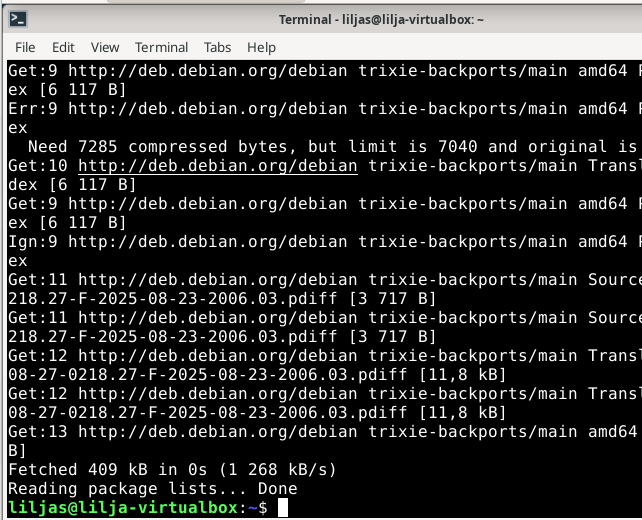

_Komento suoritettu onnistuneesti_

# a) Micro-editorin asentaminen
Lähdin asentamaan Micro-editoria ohjeiden mukaisesti. Terminaali oli jo auki, joten jatkoin siitä eteenpäin:
* Syötin komennon `sudo apt install micro`

  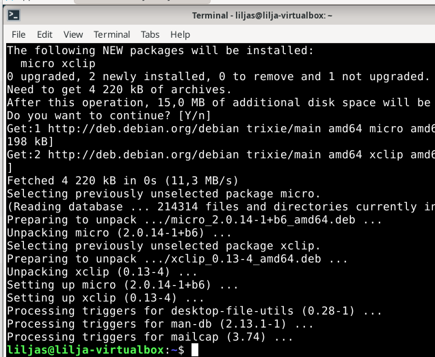
  
 _Asennus onnistui_ 
  
* Seuraavaksi syötin komennon `micro testitiedosto.txt` eli tällä avataan tiedosto, jonka loin aiemmin.
  
  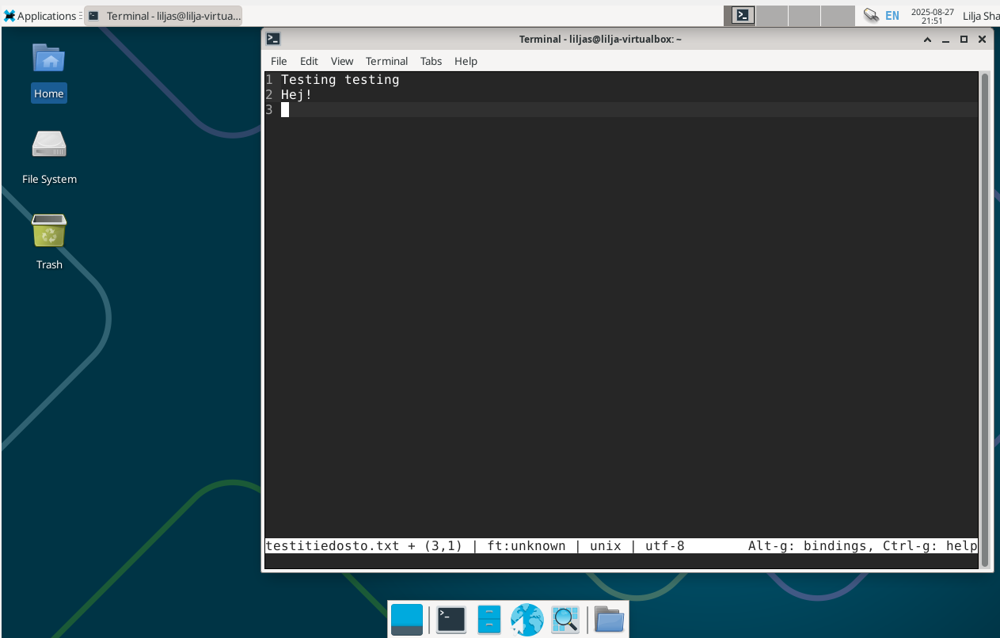
  _Tiedoston avaus micro-editorilla_
  
  
# b) APT - Kolmen uuden komentoriviohjelman asennus

Edellisessä harjoituksessa asensin Matrixin ja Steam Locomotiven. Halusin nyt kokeilla muita komentoriviohjelmia. 

## Fortune
Syötetään komennot:
* `sudo apt install fortune`
* `fortune`

**Virhetilanne** - jostakin syystä kaikki vitsit/lainaukset olivat italiaksi. 
 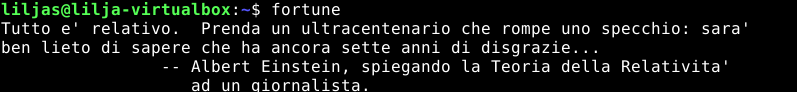 

Lähdin tutkimaan asiaa. Komentorivit alla, jolla etenin virhetilanteen korjaamiseen.

* `dpkg -l | grep fortune` - jolla tarkistin kokoelmat
*  `sudo apt remove fortune-it` ja `sudo apt remove fortune-fi` - eli suomenkielen ja italiankielen poistaminen ja lopuksi salasanan syöttö
*  `ls /usr/share/games/fortunes` - jolla tarkistin tietokannan kielet
*  `fortune /usr/share/games/fortunes/fortunes` - uudelleenajo englanninkieliseen kokoelmaan
*  `sudo dpkg-reconfigure locales` ja listalta etsin `en_US.UTF-8 UTF-8`
*  `fortune`
*  `sudo apt-get purge fortunes`
*  `sudo apt install fortunes`

 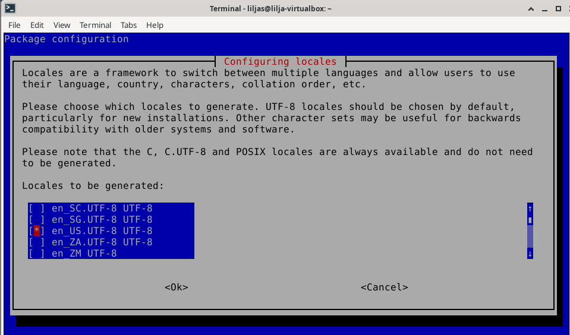 
 _Kieliasetusten määrittely uudelleen_

 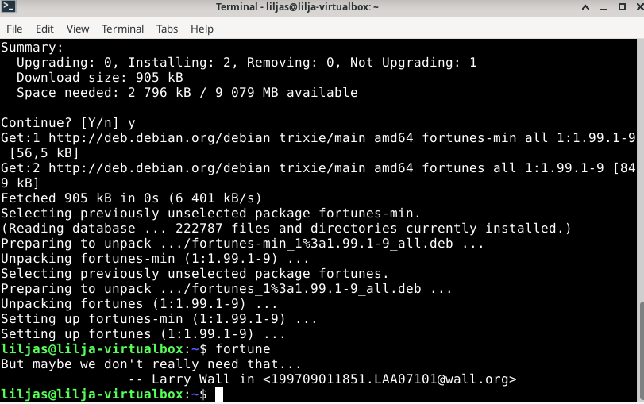 
 
 _Onnistuminen_

Helpommalla olisi voinut varmaankin päästä poistamalla ja asentamalla ohjelma vain uudelleen, mutta tulipahan harjoiteltua tätäkin.

## Figlet
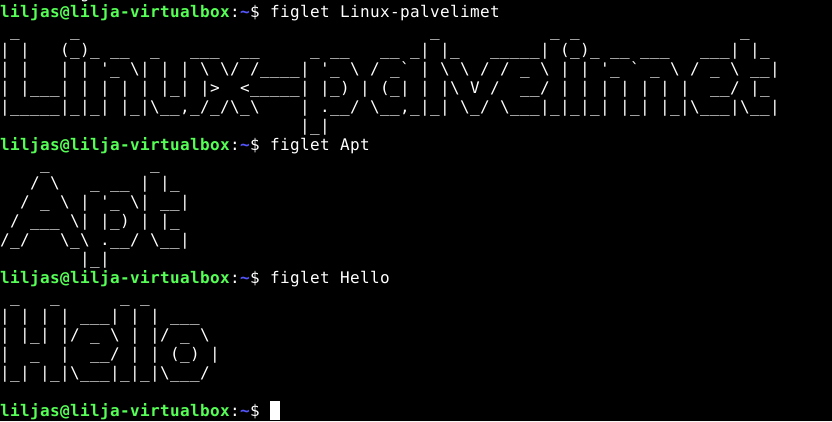 

* `sudo apt install figlet` – komennolla asennettiin Figlet-komentoriviohjelma
*  kirjoitin `figlet Linux-palvelimet` ja teksti tuli suurena ASCII-taideteoksena komentoriville.

## Cowsay
 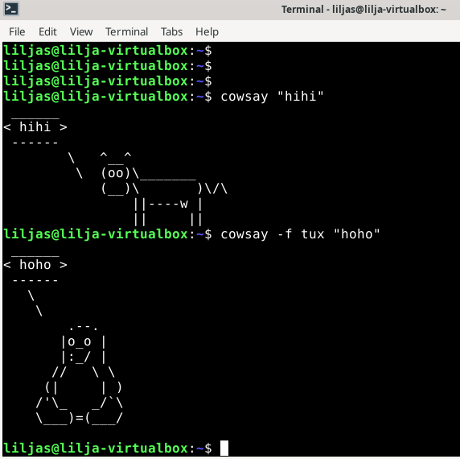 

Tämän ohjelman asennus eteni seuraavasti:

* `sudo apt install cowsay`
* `cowsay -f tux "hoho"` – komennolla tulostui hahmo tux.
* `sudo apt-get -y install cowsay fortunes figlet` – komentorivillä sain kaikki kolme ohjelmaa asennettua yhdellä komennolla, kuten Karvinen (2020) artikkelissaan neuvoi.

## Nethack 
 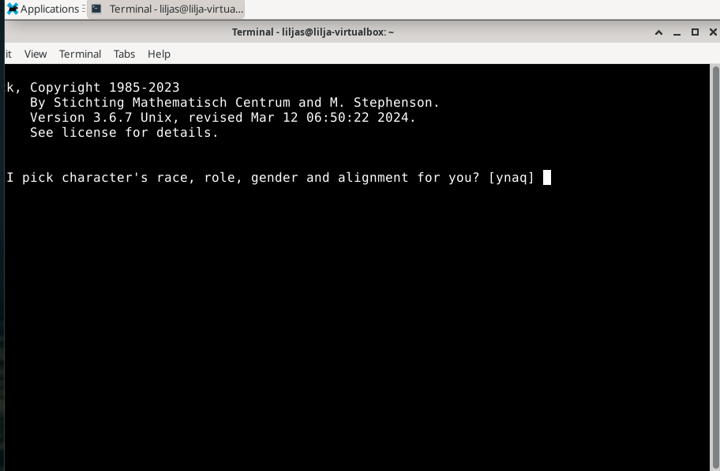 
 
 * `sudo apt install nethack-console`
 * `nethack`

# c) FHS - Kansioiden esittelyt
Etenin esittelemään "Important directories" -kappaleen kansiot.

* `ls /` kometorivillä listasin juurihakemiston sisällön.

* ls -komennolla tarkistin siis paikkoja ja sisältöjä. Etenin home -hakemistosta kotihakemisoon, liitettyjen medioiden, sekä lokitiedostojen katseluun

Alla kuvat komentoriveistä, kansioista ja tiedostoista.

  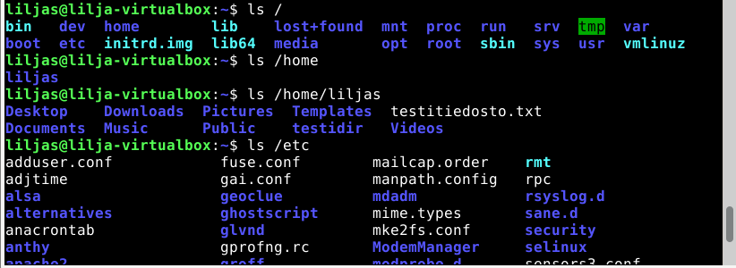
   
   _Juurihakemistot, tiedostot, kotihakemisto, asetustiedostot järjestelmässä_ 
  
  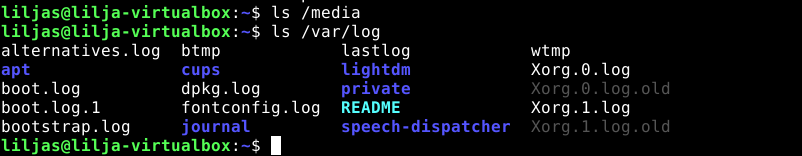
   
   _Mediahakemisto joka tyhjä, lokitiedostoja komennolla `ls /var/log`_
  
  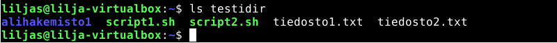
  
  _Tunnilla luotu hakemisto jossa alikansio, kaksi skriptiä ja kaksi tekstitiedostoa_

# d) The Friendly M. - grep esimerkit

grep (Global Regular Expression Print) komentorivityökalulla voi hakea tiettyjä sanoja ja tietoja tiedostoista.

Käytin tässä tehtävässä Youtube-videota (Schafer, C.) jossa oli hyvät ohjeet grep-komennon käyttöön aloittelijalle.

Aloitin tehtävän lisäämällä tekstiä luotuun tiedostoon `testitiedosto.txt`. Tekstin lisäämistä tiedostoon lähdin kokeilemaan muutamalla eri tavalla.

Nano-editorin kautta:
* `nano testitiedosto.txt`
* tallennus tapahtui **ctrl + O** -näppäimillä. Enterillä siirryttiin seuraavalle riville ja **ctrl + X** poistuttiin nano-editorista.

 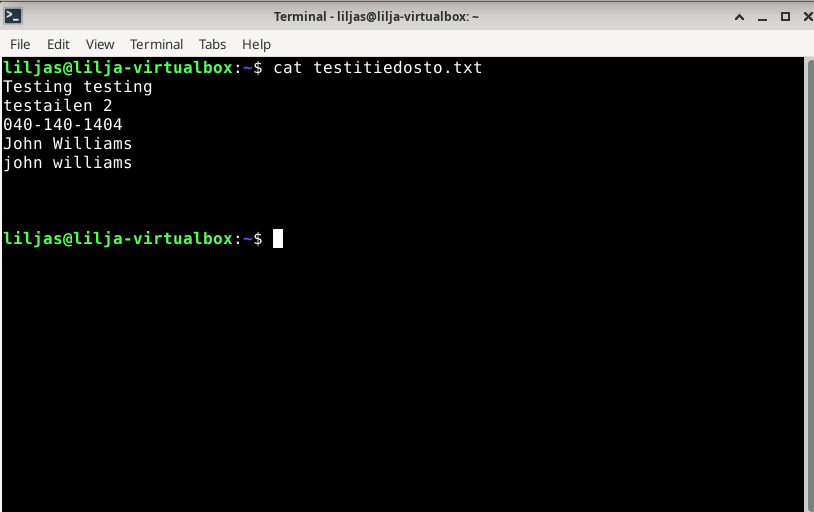

**`cat testitiedosto.txt`-komennolla** tarkistin myös tiedoston sisällön.

**Ensimmäinen**
 * `grep "testi" testitiedosto.txt`-komennolla löytyi `testitiedosto.txt`-tiedostoon kirjoittamani teksti. 
 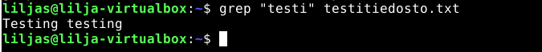

**Toinen**
* `grep "...-..." testitiedosto.txt` komennolla löysin puhelinnumeron kyseisestä tiedostosta.

 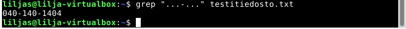

**Kolmas**
* `grep -wi "John Williams" testitiedosto.txt` -komennolla löydetään kaikki rivit, joissa esiintyy “John Williams".
* -w  hakee kokonaiset sanat ja i- jättää huomioimatta kirjainkoon.

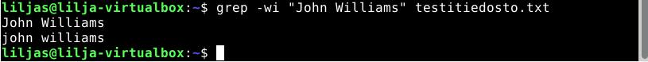

# e) Pipe - esimerkki putkista

Pipe (|) on ohjaus/redirektio yhdestä ohjelmasta toiseen. Tuloste saadaan siis siirtymään toiseen komentoon putkituksen avulla symbolia käyttämällä.

Youtube-videoissa (Lichtman, N) ja (Holidayvlr) ja sivustolla geeksforgeeks kiteytettiin hyvin piping -toiminto. Piping eli | -symbolin käyttäminen.

Syötin putkeen A syötteen, joka siirtyi (|) avulla putkeen B.

Alla oma esimerkkini, joka avasi minulle hyvin asiaa.

* `ls | grep testi`
* etsin siis grepillä putken avulla kaikki testi -sanan sisältävät paikat.

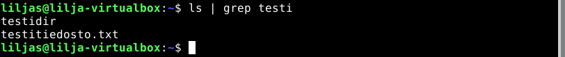
_lopputulos_

# f) Koneen raudan listaus ja analyysi

Lähdin listaamaan testaamani koneen rautaa syöttämällä `sudo apt install lshw` -komennon. Asennus alkoi salasanan syötön jälkeen.

Oli aika kokeilla uudelleen komentoa `sudo lshw -short -sanitize` jolla listasin koneen raudan tiivistetysti ilman sarjanumeroja tai arkaluonteisia tietoja.

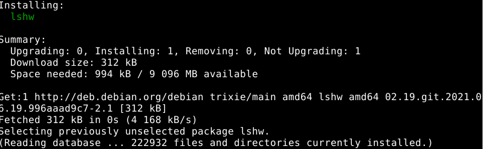

**Listauksen analysointi** 

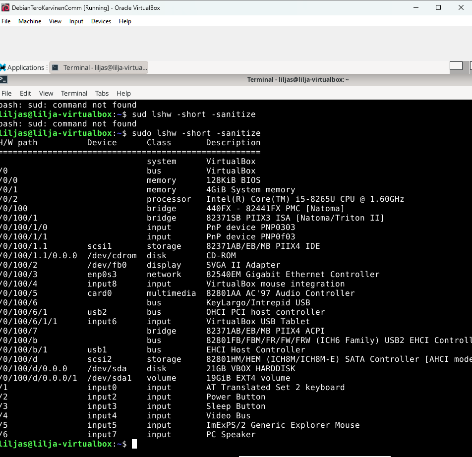

**Processor** -eli fyysisen raudan prosessori. 

**/dev/cdrom/** (ISO-levykuvien CD/DVD asema)

**/0/1/ 4GB "memory"** -Muisti

**network 8240EM Gigabit** Ethernet Controller* -verkkokortti

**Display SVGA || Adapter** -näytönohjain

**Device** -laitteen nimi

**Class** -käyttämä luokka  

**Description** -laitteen kuvaus

Yllä olevat tiedot oli jokseenkin helppo tulkita, sillä aiemmassa tehtävänannossa ja muissa on tullut muutamia kertoja listattua koneen tekniset tiedot. Lisäsin listaan muutamia oleellisia, joista on ollut tässä kurssin alussa jo puhetta.

# g) Lokirivien tulkinta ja analyysi

Aloitin tutustumalla (Ellingwood, J. & Kurup, M.) pikaohjeeseen ja katsomalla videon "journalctl Basics: How to Easily Check Your Linux Logs". Lopuksi kuitenkin Logglyn "Ultimate guide, using journalctl" osoittautui hyödyllisimmäksi itse tulkinnan osalta.

**`journalctl --list-boots` -komento**

 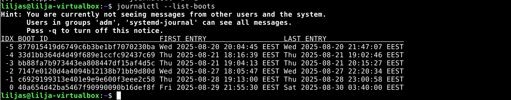
 
Listalla nähdään seuraavia asioita vasemmalta oikealle:

**-0** on latest boot eli viimeisin käynnistys *-1* ennen sitä, ja niin edelleen.

**BOOT ID**, pitkä hexadesimaali numero*

**aikaleima**

**viimeisimmät viestit kyseessä olevaan käynnistykseen**

**`journalctl _UID=1000` -komento**

 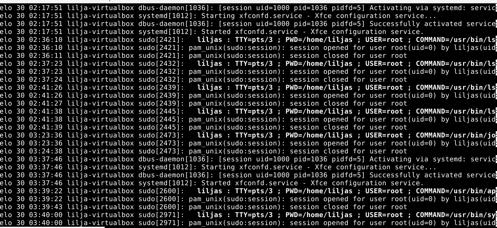

Tässä auttoi hieman se, että suurin osa lokitiedoista oli vain ns. "perustietoja" jotka oli helppo tulkita. Muita joutui hieman eri lähteistä Googlettaa, sillä aihe oli täysin uusi.

Listalla nähdään seuraavia asioita vasemmalta oikealle:

*aikaleima elo 30 02:36:11*

*koneen nimi lilja-virtualbox* 

*prosessi, sudo 2421*

*käyttäjänimi, liljas*

*terminaali/laite josta komento ajettiin, TTY=pts/3*

*Ympäristö/hakemisto, PWD=/home/liljas*

*käyttäjä: root (USER=root)*

*suoritettu komento, COMMAND=/usr/bin/lsblk*

*root käyttäjä kirjautui sisään ja root -käyttäjä kirjautui ulos: "session opened for user root (uid=0) - session closed for user root"*

# h) Plugin asennus micro-editoriin ja testaus
Etenin Githubissa ohjeen (Karvinen, T.) opastuksella. Micro-editorin pluginin Paletteron asentamiseen. 

**Ennen asennusta**
*`sudo apt-get update`
*`sudo apt-get -y install fzf`
*`sudo apt-get -y install pythonpy # optional`
Eli ensin vaadittavat fzf ja bash ja lisukkeeksi pythonpy.

**Asentaminen** 
´micro --plugin install palettero´
Kävin testiksi kokeilemassa yllä olevaa, jospa olisi riittänyt vain tuo komento. 

Ei vielä toiminut, joten jatkoin vielä alla olevilla:
`cd $HOME/.config/micro/plug/`
`git clone https://github.com/terokarvinen/palettero` 

Suljin terminaalin ja käynnistin uudelleen. Seuraavaksi käynnistin micro-editorin:
*`micro testitiedosto.txt` ja enter

 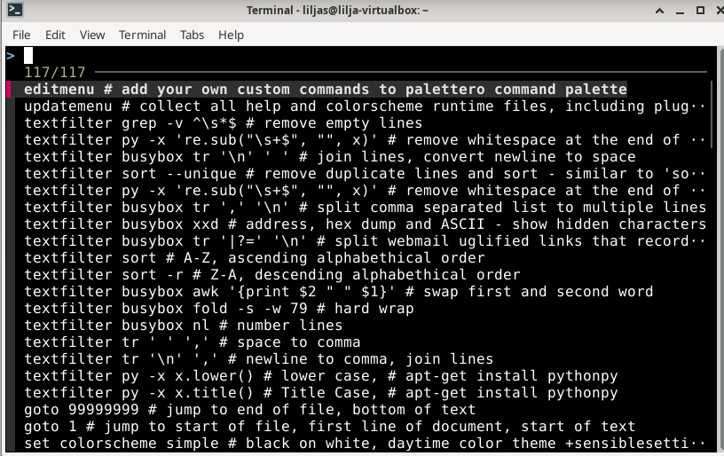
 
* `ctrl + space`-komennolla avasin micro-editorin pluginin Paletteron. A
* Aukesi lista, jota selasin nuolinäppäimillä.
* Löysin sopivan testauksen eli valitsin väriteemaksi "solarized" kuten kuvaksi alla, niin alalaidan tekstitiedostorivi muuttui liilaksi.

 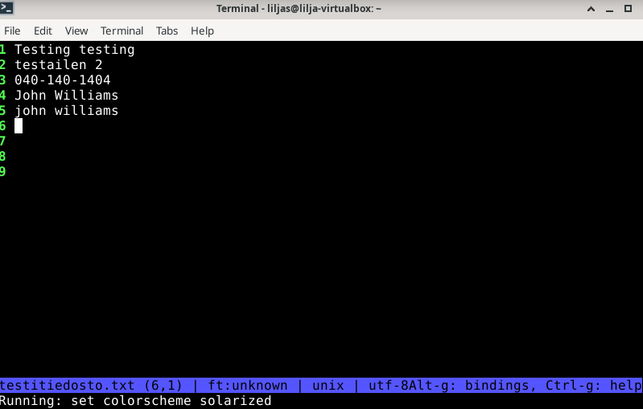

Kello olikin jo 0.16 seuraavana päivänä 02.09.2025 kun sen sai lopulta valmiiksi. Tehtävää tein osissa, jotta jokaisen kohdan ymmärtäminen konkretisoituu. Harjoitus oli erinomainen alku. Oppista vielä on paljon ja kertausta sitäkin enemmän. Oikein mukava harjoitus kaikinpuolin.
 
## LÄHTEET

Akamai Developer. 2023. Youtube. Video. _Linux Hardware Commands | How To Inspect Hardware on A Linux Instance_ Katsottavissa: https://www.youtube.com/watch?v=3redTP2Zkeg&t=367s Katsottu: 1.9.2025.

Avishek. 2023. Verkkosivu. _Funny Linux-commands_. Luettavissa: (https://www.tecmint.com/funny-linux-commands/) Luettu: 28.08.2025.

Bugs. 2006. Verkkosivu. _fortune in foregein language_ Luettavissa: https://bugs.launchpad.net/ubuntu/+source/fortune-mod/+bug/75659 Luettu: 28.08.2025.

Ellingwood, J. & Kurup, M. 2025. DigitalOcean. Artikkeli. _How To Use journalctl to View and Manipulate systemd Logs on Linux_ Luettavissa: https://www.digitalocean.com/community/tutorials/how-to-use-journalctl-to-view-and-manipulate-systemd-logs Luettu: 1.9.2025.

Freedesktop. Verkkosivu. _Journalctl man page_ Luettavissa: https://www.freedesktop.org/software/systemd/man/latest/journalctl.html Luettu: 1.9.2025.

Geeksforgeeks. 2024. Verkkosivu. _Piping in Unix or Linux_ Luettavissa: https://www.geeksforgeeks.org/linux-unix/piping-in-unix-or-linux/ Luettu: 1.9.2025.

Geeksforgeeks. 2024. Verkkosivu. _lshw command in Linux with Examples_ Luettavissa: https://www.geeksforgeeks.org/linux-unix/lshw-command-in-linux-with-examples/ Luettu: 1.9.2025.

Holidaylvr. 2014. Youtube. Video. _Pipe() tutorial for linux_ Katsottavissa: https://www.youtube.com/watch?v=uHH7nHkgZ4w  Katsottu: 1.9.2025

Karvinen, T. 2024. Verkkosivu. _Palettero - command palette / menu for Micro editor_ Luettavissa: https://github.com/terokarvinen/palettero Luettu: 1.9.2025.

Karvinen, T. 2020. Verkkosivu. Artikkeli. _Command Line Basics Revisited_. Luettavissa: https://terokarvinen.com/2020/command-line-basics-revisited/?fromSearch=command%20line%20basics%20revisited Luettu 28.8.2025.

Karvinen, T. 2024. Verkkosivu. _Linux-palvelimet_ Luettavissa: https://terokarvinen.com/linux-palvelimet/ Luettu 28.8.2025.

LinuxQuestions.org. 2017. Keskustelufoorumi. _All my fortunes are in different language_ Luettavissa: https://www.linuxquestions.org/questions/debian-26/fortune-all-my-fortunes-are-in-a-different-language-4175618845/ Luettu: 28.08.2025.

LinuxQuestions.org. 2004. Keskustelufoorumi. _How to change the default language of the system_ Luettavissa: https://www.linuxquestions.org/questions/linux-general-1/how-to-change-the-default-language-of-the-system-181319/ Luettu: 28.08.2025.

Lichtman, Nir. 2024. Youtube. Video. _Linux Pipes Explained in 3 Minutes_ Katsottavissa: https://www.youtube.com/watch?v=NlFvGZoAgTs Katsottu: 1.9.2025.

Learn Linux TV. Youtube. Video. _journalctl Basics: How to Easily Check Your Linux Logs_ Katsottavissa: https://www.youtube.com/watch?v=0dG3vUYt7Uk&t=75s Katsottu 1.9.2025.

Schafer, C. 2018. Youtube. Video. _Linux/Mac Terminal Tutorial: The Grep Command - Search Files and Directories for Patterns of Text_ Katsottavissa: (https://www.youtube.com/watch?v=VGgTmxXp7xQ) Katsottu 29.8.2025.

StackExchange. 2017. Verkkosivu. _Difference between ts and tty_ Luettavissa: https://unix.stackexchange.com/questions/21280/difference-between-pts-and-tty Luettu: 1.9.2025.

StackExchange. 2015. Verkkosivu. _What is $PWD? (vs current working directory)_ Luettavissa: https://unix.stackexchange.com/questions/174990/what-is-pwd-vs-current-working-directory Luettu: 1.9.2025.

Techmint. 2023. Verkkosivu. _24 Funniest Commands to Try in the Linux Terminal_ Luettavissa: https://www.tecmint.com/funny-linux-commands/ Luettu: 28.08.2025.

