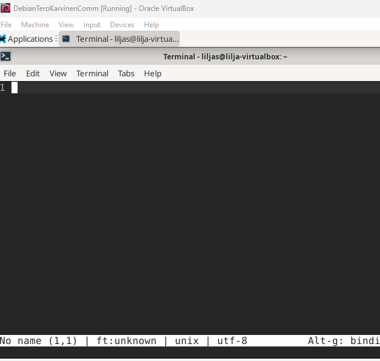
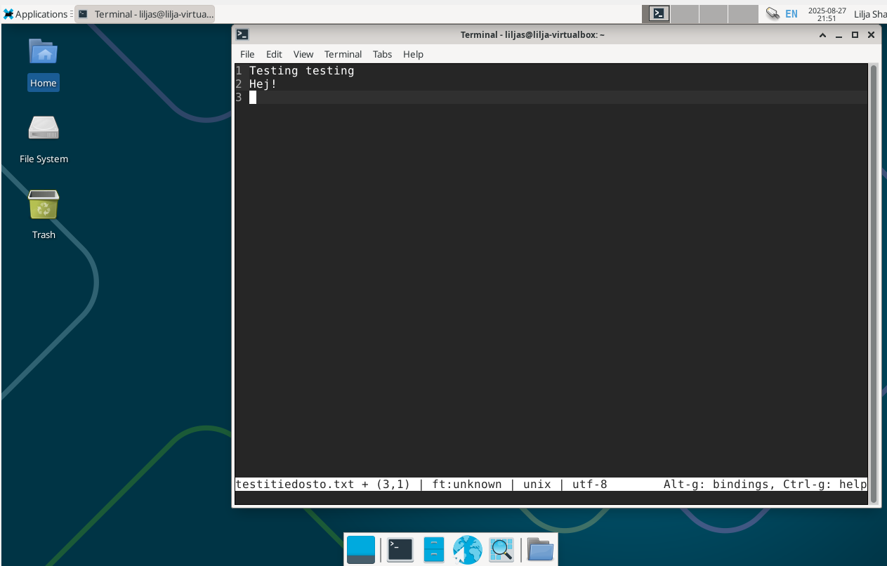

# h2 Komentaja Pingviini
 
## Sisältö
* [x) Artikkeli](#x-artikkeli)
* [a) Micro-editorin asentaminen](#a-micro-editorin-asentaminen)
* [b) APT - Kolmen uuden komentoriviohjelman asennus](#b-apt---kolmen-uuden-komentoriviohjelman-asennus)
* [c) FHS - Kansioiden esittelyt](#c-fhs---kansioiden-esittelyt)
* [d) The Friendly M. - grep esimerkit](#d-the-friendly-m---grep-esimerkit)
* [e) Pipe - Esimerkki putkista](#e-pipe---esimerkki-putkista)
* [f) Koneen raudan listaus ja analyysi](#f-koneen-raudan-listaus-ja-analyysi)
* [g) Lokirivien tulkinta ja analyysi](#g-lokirivien-tulkinta-ja-analyysi)
* [h) Plugin asennus micro-editoriin ja testaus](#h-plugin-asennus-micro-editoriin-ja-testaus)

## Koneen tekniset tiedot
* Prosessori: Intel Core i5-8265U CPU @ 1.60 GHz (1.80 GHz turbo, 8 ydintä)
* RAM: 16 GB (15,7 GB käytettävissä)
* Järjestelmä: Windows 11 Pro 64-bittinen (x64-suoritin)
* Näytönohjain: Intel UHD Graphics 620
* Tallennustila: 237 GB, josta 158 GB vapaana
* DirectX-versio: DirectX 12

# x) Artikkeli

- Linuxin käyttämän komentosarjan kerrotaan olleen jo olemassa ennen Googlea, itse Linuxia, Windowsia ja jopa Internetiä.
- Sen kerrotaan olevan käytännöllinen, helppo automatisoida ja nopea.
- Artikkelissa käydään läpi komentosarjan perusteita, jotka on hyvä harjoitella ulkoa. Komentosarjat liittyvät muun muuassa navigointiin, ohjelmistojen asentamiseen ja ylläpitoon, apukomentoihin, tärkeisiin hakemistoihin ja muihin oleellisiin komentosarjoihin.

## Lähteet

Karvinen, T. 2020. Artikkeli. _Command Line Basics Revisited_. Luettavissa: https://terokarvinen.com/2020/command-line-basics-revisited/?fromSearch=command%20line%20basics%20revisited Luettu 27.8.2025.

## Ennen asentamista
Ennen Micro-editorin asentamista etenin seuraavasti, valmistellen ympäristön asennukseen.

* Virtuaalikoneen käynnistys
* Terminaalin käynnistys alalaidan keskiosan pikakuvakkeesta klikkaamalla
* `sudo apt-get update` komento ja salasanan vahvistus

Alla olevassa kuvassa komento suoritettu onnistuneesti.

# a) Micro-editorin asentaminen
Lähdin asentamaan Micro-editoria ohjeiden mukaisesti. Terminaali oli jo auki, joten jatkoin siitä eteenpäin:
* Syötin komennon `sudo apt install micro`

  

  _Asennus onnistui_ 
  
* Seuraavaksi syötin komennon `micro testitiedosto.txt` eli tällä avataan tiedosto, jonka loin aiemmin.
  
  
  
# b) APT - Kolmen uuden komentoriviohjelman asennus

# c) FHS - Kansioiden esittelyt

# d) The Friendly M. - grep esimerkit
# e) Pipe - esimerkki putkista (pipes, "|").
# f) Koneen raudan listaus ja analyysi
# g) Lokirivien tulkinta ja analyysi
# h) Plugin asennus micro-editoriin ja testaus

## LÄHTEET

